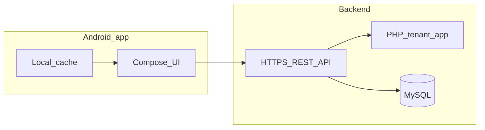

# MECHANIX mobile app — feature specification (Android Studio)

This document defines features for a **native Android** companion app (Kotlin, Jetpack Compose, Material 3) for **two personas**: **Customer** and **Mechanic**. Visual design **must align** with the existing MECHANIX web app theme defined in `assets/css/styles.css` (neutral monochrome, light/dark), not generic Material defaults.

---

## 1. Product summary

| Item | Decision |
|------|----------|
| **Product** | Single installable app with **two post-login experiences** determined by account type: Customer or Mechanic. |
| **Brand** | MECHANIX — multi-tenant auto repair SaaS; mobile is **tenant-scoped** after authentication. |
| **Recommended stack** | Android Studio, Kotlin, Jetpack Compose, Material 3 with a **custom `ColorScheme`** mapped from web CSS variables. Navigation Compose, DataStore (theme + tokens), WorkManager for background sync, optional Firebase Cloud Messaging for push. |
| **Currency / region** | Web uses PHP formatting (e.g. `PHP`); mobile should follow the same locale rules once API exposes them. |

---

## 2. Design alignment (web parity)

### 2.1 Color tokens → Android semantic roles

Map **MECHANIX** web variables to Compose / Material 3 roles. Do **not** use the default M3 purple seed; drive `lightColorScheme` / `darkColorScheme` from this table.

| Web token | Light (`:root`) | Dark (`html[data-theme="dark"]`) | Android (semantic) |
|-----------|-----------------|-----------------------------------|---------------------|
| `--bg` | `#f5f5f5` | `#0a0a0a` | `ColorScheme.background` |
| `--bg-soft` | `#ffffff` | `#111111` | `surface` / `surfaceContainerLowest` |
| `--bg-elevated` | `#fafafa` | `#171717` | `surfaceContainerLow` / elevated cards |
| `--text` | `#111111` | `#f5f5f5` | `onBackground`, `onSurface` |
| `--text-soft` | `#525252` | `#b5b5b5` | `onSurfaceVariant` |
| `--border` | `#d4d4d4` | `#2a2a2a` | `outline` |
| `--border-strong` | `#a3a3a3` | `#404040` | stronger dividers / focus rings |
| `--button-bg` | `#111111` | `#f5f5f5` | `primary` |
| `--button-text` | `#ffffff` | `#111111` | `onPrimary` |
| `--button-hover` | `#262626` | `#d4d4d4` | `primaryContainer` / pressed state |
| `--input-bg` | `#ffffff` | `#111111` | `surface` for text fields |

**Shadows:** Web uses `0 10px 30px` / `0 6px 18px` rgba stacks; on Android use `elevation` + subtle `ambientColor` / `spotColor` tuned to match light vs dark surfaces.

### 2.2 Shape and motion

| Web | Android |
|-----|---------|
| `--card-radius` 24px | Cards: `RoundedCornerShape(24.dp)` (scale down slightly on very small widths if needed). |
| `--radius-md` 16px | Medium components (dialogs, sheets). |
| `--radius-sm` 12px | Chips, small tiles. |
| Pills (999px) | `RoundedCornerShape(50)` or `CircleShape` for FAB-style pills. |
| `--transition: 0.25s ease` | **200–300 ms** `FastOutSlowInEasing`; respect `android.settings.accessibility` / `withReducedMotion` patterns. |

### 2.3 Typography and brand mark

- **Web body font:** Inter (`assets/css/styles.css`). On Android: embed **Inter** via `androidx.compose.ui:ui-text-google-fonts` or bundle font files for parity.
- **Hierarchy:** Title → headline → body → label; keep line height comfortable (~1.5) for long job/invoice copy.
- **Brand mark:** Landing uses an **“M”** monogram in a rounded square (`~42px`, `border-radius: 14px` in mock). Reuse for **launcher icon**, **splash**, and in-app header.

### 2.4 Theme behavior

- Mirror `assets/js/theme.js`: **Light**, **Dark**, and optional **Follow system**; persist choice in DataStore.
- First launch: if no saved preference, default from `UiModeManager` / night mode (equivalent to `prefers-color-scheme` on web).

---

## 3. Customer features

### MVP

| Feature | User story | Acceptance notes |
|--------|------------|-------------------|
| **Secure auth** | As a customer, I can sign in so only I see my shop’s data. | Email/phone + password or magic link **per product decision**; session refresh; logout; no multi-tenant data leakage. |
| **Registration / shop access** | As a new customer, I can join my shop’s workspace. | Tenant join via **invite code**, **deep link**, or **admin-created** account; clarify with backend. |
| **Profile** | As a customer, I can view and edit my contact details allowed by the shop. | Fields aligned with `customers` model; validation; errors inline. |
| **Vehicles** | As a customer, I can see vehicles linked to my account. | List + detail (make, model, plate, year); read-only unless API allows edits. |
| **Appointments** | As a customer, I can request and manage appointments. | Create request, list upcoming/past, cancel/reschedule **if shop policy + API** allow; respect tenant feature `appointments`. |
| **Job status (read-only)** | As a customer, I can track repair progress. | Timeline or steps reflecting `jobs.status` and related events; no edits that bypass shop workflow. |
| **Notifications** | As a customer, I am notified when status changes. | Push (FCM) and/or in-app inbox; tap navigates to job/appointment. |
| **Theme toggle** | As a customer, I can use light or dark mode like the website. | Uses §2 tokens; persisted. |
| **Accessibility & touch** | As a customer with motor or vision needs, I can use the app comfortably. | Min **48 dp** touch targets, TalkBack labels, contrast from §2.1. |
| **Offline reads** | As a customer, I can reopen recent screens without network. | Cache last successful responses for vehicles/jobs list; show stale banner when offline. |

### Phase 2

| Feature | User story | Acceptance notes |
|--------|------------|-------------------|
| **Invoices** | As a customer, I can view invoices for my jobs. | List/detail; PDF open/share if API provides URL; tenant feature `invoicing`. |
| **Payments** | As a customer, I can see payment status and pay when required. | Read status from API; checkout **via secure web flow or PayMongo SDK** as backend defines; tenant feature `payments`. |
| **Service history** | As a customer, I can see past services per vehicle. | Aggregated from jobs/services APIs. |
| **Messaging** | As a customer, I can message the shop. | Thread per tenant; optional push; rate limits. |

### Phase 3

| Feature | User story | Acceptance notes |
|--------|------------|-------------------|
| **Loyalty / promos** | As a customer, I can redeem offers from my shop. | Depends on new backend modules. |
| **Bulk booking** | As a customer, I can book multiple vehicles in one flow. | UX wizard; optional. |
| **Preferred mechanic** | As a customer, I can request a mechanic if the shop allows. | Soft preference stored; shop may ignore; ties to `mechanic_id` when applicable. |

---

## 4. Mechanic features

### MVP

| Feature | User story | Acceptance notes |
|--------|------------|-------------------|
| **Mechanic auth** | As a mechanic, I can sign in to see only my tenant’s assignments. | Distinct from admin/cashier session rules on web today; dedicated API. |
| **Assigned jobs** | As a mechanic, I see jobs assigned to me. | Filtered by `jobs.mechanic_id` = current user; sort by date/priority. |
| **Job detail** | As a mechanic, I open a job and see customer, vehicle, and line items. | Customer + vehicle + services; respect `jobs` + `customer_module` flags. |
| **Update job status** | As a mechanic, I move work forward in the pipeline. | Align with server rules: web admin `admin/actions/update_job_status.php` allows transitions to **`ongoing`** and **`completed`** only when the source **appointment** is **`approved`**, and **blocks** changes if an **invoice** already exists for the job. Mobile API must enforce the same invariants (do not reimplement weaker checks only on client). |
| **Job list freshness** | As a mechanic, I see new assignments quickly. | Pull-to-refresh + push notification on new assignment. |
| **Notes / photos (spec)** | As a mechanic, I attach evidence of work. | Optional MVP: text notes; Phase 2: camera + secure upload URLs from API. |

### Phase 2

| Feature | User story | Acceptance notes |
|--------|------------|-------------------|
| **Parts usage** | As a mechanic, I log parts used on a job. | Mirror `job_part_usage` workflows; tenant `inventory` + `jobs`; only while job rules allow edits (e.g. ongoing, no invoice). |
| **Labor / checklist** | As a mechanic, I follow a standardized checklist. | Configurable checklist from API. |
| **Upcoming appointments** | As a mechanic, I see bay schedule. | Read-only or acknowledge; `appointments` feature. |
| **Time on job** | As a mechanic, I track time spent for payroll. | Start/stop timer per job; audit trail. |

### Phase 3

| Feature | User story | Acceptance notes |
|--------|------------|-------------------|
| **Team chat** | As a mechanic, I coordinate with colleagues. | Realtime channel; moderation. |
| **Shift handoff** | As a mechanic, I hand off incomplete jobs. | Structured notes + reassignment request (admin approves). |
| **Barcode scan** | As a mechanic, I scan parts SKUs. | Camera ML Kit / ZXing; validate against inventory API. |

---

## 5. Cross-cutting requirements

- **Tenant isolation:** Every API call includes **tenant context** (header or path) consistent with `tenant_id` in the PHP app.
- **Feature flags:** UI modules **hidden or disabled** when the tenant lacks features (`appointments`, `jobs`, `invoicing`, `payments`, `customer_module`, `mechanic_module`, etc.) per `includes/feature_access.php` semantics.
- **Security:** No API keys embedded in APK; use **short-lived access tokens** + refresh; store secrets in **EncryptedSharedPreferences** or encrypted DataStore; **TLS** with **pinning** for production.
- **Localization:** Externalize strings; support future multi-language.
- **Error handling:** Network errors, 401/403, and validation messages surfaced with **retry** where appropriate (mobile-design: avoid dead ends).

---

## 6. Dependencies / backend

The current PHP web app uses **session-based** tenant login and **does not** expose mechanic or customer dashboards for all roles (`actions/login_process.php` routes **admin** and **cashier** only). A mobile app **requires**:

1. **HTTPS JSON API** (REST or similar) authenticated with **Bearer tokens** (or equivalent), issuing claims for `user_id`, `tenant_id`, and `role` (`customer` | `mechanic`).
2. **Customer identity model**: customer records linked to login credentials (new tables or extension of existing `customers` / `users`).
3. **Mechanic identity**: reuse `users` with `role = mechanic` where appropriate, with API authorization distinct from admin UI.
4. **Push:** FCM device registration endpoint per tenant/user.

*(API may be implemented as new PHP routes, a slim proxy, or a separate service — product decision.)*

---

## 7. Out of scope (this document)

- **Super Admin** flows (tenant onboarding, billing console) — remain web-first.
- **Full inventory administration** — desktop-first admin panel.
- **Cashier POS** — optional future app; not required for Customer/Mechanic v1.

---

## Appendix A — Design intelligence (ui-ux-pro-max)

The following was generated with the project’s **ui-ux-pro-max** skill (`search.py --design-system`) for keywords *auto repair SaaS customer mobile professional minimal* / project name **MECHANIX**. It suggests patterns (minimal column, flat style) and **generic** palette examples that **do not match** the live MECHANIX web theme.

**Authoritative palette for this app:** §2.1 in this document (tokens from `assets/css/styles.css`). Use the rows below only for **layout/UX** ideas (single CTA, whitespace, checklist), not for primary colors.

### Pattern (reference)

- **Minimal single column:** Single CTA focus, large typography, whitespace, mobile-first.
- **Sections:** Hero headline → short description → benefit bullets (max 3) → CTA → footer (adapt for native onboarding/marketing screens if any).

### Style (reference)

- **Flat / minimal:** Clean lines, typography-focused, icon-heavy (SVG sets: Heroicons, Lucide — **not emoji** as icons).
- **Motion:** 150–200 ms ease; no gratuitous gradients if parity with web “soft neutral” look is priority.

### Tool-suggested colors (non-authoritative — superseded by §2.1)

| Role | Hex (tool output) |
|------|-------------------|
| Primary | #2563EB |
| Secondary | #3B82F6 |
| CTA | #F97316 |
| Background | #F8FAFC |
| Text | #1E293B |

### Anti-patterns to avoid (from tool + MECHANIX parity)

- Complex onboarding when a single shop join code suffices for MVP.
- Cluttered dashboards; hidden focus states; missing `prefers-reduced-motion`.
- Using **emoji** as substitute for iconography in production UI.

### Pre-delivery checklist (mobile)

- [ ] SVG icons (consistent set), not emoji icons  
- [ ] Tappable rows/buttons ≥ 48 dp height  
- [ ] Visible focus / TalkBack on interactive elements  
- [ ] Light and dark tested at **375dp** width; no horizontal scroll on core flows  
- [ ] Reduced motion respected  
- [ ] Primary colors taken from **§2.1**, not Appendix A’s blue/orange  

---

*Document version: 1.0 — aligned with MECHANIX web theme in `assets/css/styles.css`.*
